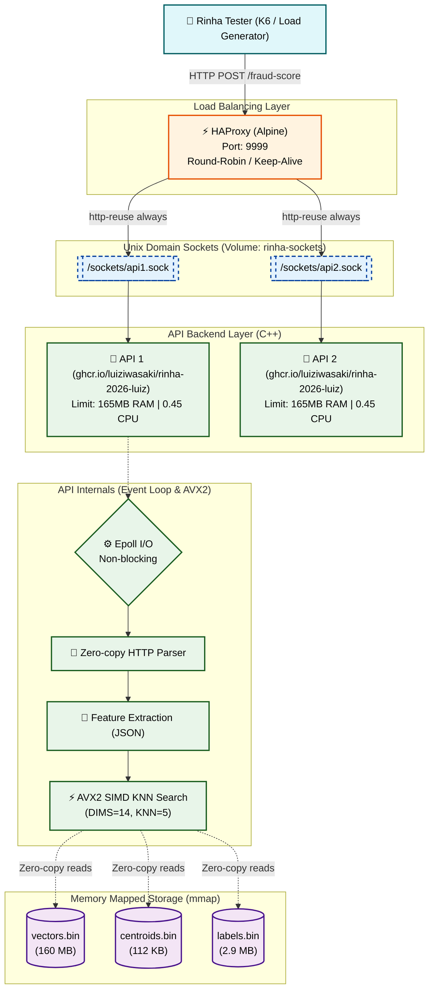

<div align="center">
  <h1>⚔️ Rinha de Backend 2026 - Submission</h1>
  <p><strong>A "Bare-Metal" C++ solution focused on sub-millisecond latency, SIMD (AVX2) processing, and non-blocking I/O via Epoll.</strong></p>
</div>

<br>

## 🚀 About the Project

This is my submission for the **Rinha de Backend 2026** (Backend Fight 2026). The challenge required building a fraud risk evaluation system capable of handling high throughput under severe resource constraints (**165MB of RAM** and **0.45 CPU** per instance).

To achieve maximum performance and squeeze every CPU cycle and byte of memory, this solution was built entirely from scratch in C++.

### 🔥 Technical Highlights
- **Sub-Millisecond Latency**: The API responds to the stress test in less than `1ms` at the 99th percentile (p99).
- **No Frameworks**: The HTTP server and event loop were hand-crafted using the Linux API (`sys/epoll.h`).
- **SIMD / AVX2**: The K-Nearest Neighbors (KNN) search that determines the fraud score was optimized at the processor level, using 256-bit vector instructions (`__m256`) to calculate the Distance Squared Sum of Errors (DSSE) between vectors simultaneously.
- **Memory-Mapped Files (mmap)**: Since the fraud data/vectors weigh around ~163MB, the Docker memory limit (165MB) didn't allow loading the data into the Heap. The solution maps the static files directly into kernel memory (`MAP_PRIVATE`), avoiding memory copies (*Zero-copy*) and lazy-loading pages on demand.
- **UDS Communication (Unix Domain Sockets)**: Communication between the Load Balancer (HAProxy) and the C++ nodes happens through Unix sockets mapped in a volume, completely bypassing the internal Linux TCP/IP stack and removing internal network latency.
- **Optimized Parsing**: JSON reading with strict search algorithms without using heavy parsing libraries (no pointer allocation on the Heap).
- **HTTP Keep-Alive Pipelining**: A robust Epoll loop designed to read dozens of queued requests through the same TCP connection without bottlenecks.

---

## 🏗️ System Architecture

The topology focuses on pure speed. **HAProxy** balances the load between replicas using *Round-Robin* over physical Socket files (`.sock`), and the API instances query the pre-compiled solid-state databases.



---

## 🛠️ Data Lifecycle and Pre-Processing

The data pipeline is divided into **Multiple Docker Stages**:

1. **Builder Stage**: Compiles the C++ executables (`rinha_api` and the `preprocess` tool) with maximum optimization flags (`-O3`, `-march=native` or `-mavx2`).
2. **Pre-processing Stage**: The raw `references.json.gz` file is decompressed and processed by the internal `preprocess` tool, extracting references and calculating centroids (K-Means) at Docker image compile time. The results are highly optimized `.bin` files ready for raw byte reading.
3. **Runtime Stage**: The final Alpine container carries only the clean executable without dependencies and the `.bin` files, which will be consumed by C++'s `mmap()` for direct memory access, eliminating the need to hydrate objects in RAM.

---

## 📊 Memory Management Strategy

To avoid falling victim to the *OOM Killer (Out Of Memory)* within the Spartan `165MB` limit of the Rinha Docker Compose:
- The `MAX_CONN` connection limit was methodically sized to `2048`, pre-allocating exactly one static buffer in non-reclaimable memory (BSS) of around `8 MB`, keeping stack allocation predictable.
- The remainder (~157 MB) is entirely handed over to the Linux Kernel to serve as a *Page Cache* for the binary vectors, practically reducing *page faults* to zero after the first few requests (Warmup).
- The `MAP_POPULATE` flag was purposely avoided to prevent aggressive `ENOMEM` crashes on startup when strict cgroup limits are enforced by the host, relying safely on lazy page-faulting instead.

---

## 💻 How to Run and Test Locally

Make sure the original `references.json.gz` file from the Rinha repository is placed at the correct level (`resources/` folder or following the shell-script copy).

Start and orchestrate the containers using our automated script:
```bash
# Execution permission if needed
chmod +x build.sh

# Runs the multi-stage compilation, spins up the Docker cluster and performs the readiness Health Check
./build.sh
```
